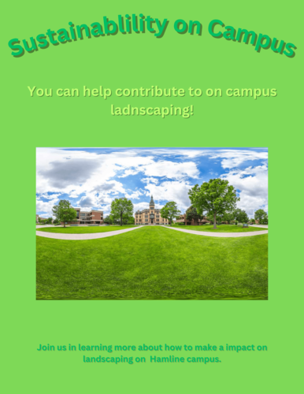

Welcome to my portfolio! This website is done using GitHub. I enjoyed coding the sustainability map so I wanted to continue doing web development. These exercises allowed me to showcase my technical, attention to detail, and problem solving skills. Aside from that, I'm currently applying for internships and jobs right now so I started to showcase my code on GitHub for employers to see. Below is project 1, the crowdbuilding project, and more.

# [Project 1: Sustainability Map](http://sustainabilitymap.hamline.edu/)
The sustainability map is a resource where one access sustainable on and off campus locations. 

### API Key
To update the map, a API key was added. The website was because made in 2017, before websites like this needed a Google API key. Originally the website was greyed out and had "For Developers Use Only". Once I had access to the webstie through Google cloud console, I went to obtained a Google maps API key. From there I downloaded the html file and opened it up in the application, Brackets. From there I scrolled towards the bottom to find the script src line. Below, is the line of code with the API key.

### Food Resource Center
Now I transitioned away from Brackets and downloaded Visual Studio Code. VSCode is where the HTML, CSS, and JavaScript file were edited in. The first three location that I added were off campus parks. And the last location I added was the Food Resource Center. I wanted to highlight the FRC because It used Nasrudin's report. The HTML file was used to add in the text and images. The CSS file allowed me to re size and format the pictures provided to me. And the JavaScript code is where I spent most of the time in. Here I added in the pin point marker, next and previous buttons, and the hover label. To achieve this I refrenced the code that was used for the other locations. Below is the html lines of the FRC.

### Google Form and Slight Website Updates

# [Crowdbuilding Project: Landscaping on Campus]
A Canva visual for the Landscaping on Campus presentation. This is a graphic intended to promote a future meeting. 

